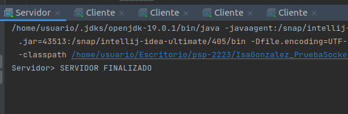
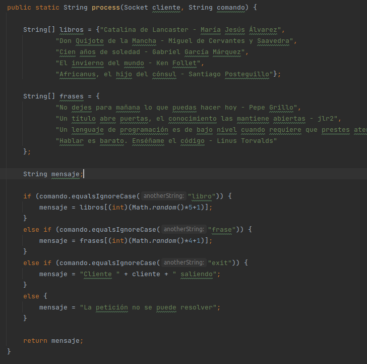
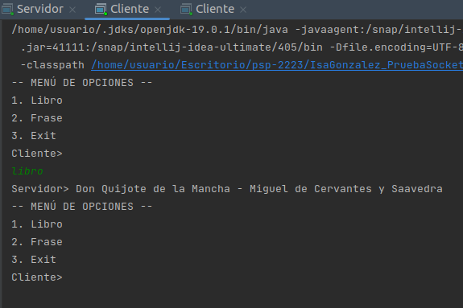

# Enunciado

Construir una app Java de nombre "Lector de Comandos" cliente/servidor en lenguaje Java que cumpla:

## De forma general

1. Permite el intercambio de mensajes de clientes con un servidor. Los mensajes deben ser modelados como objetos con un
   único atributo de tipo String.
2. Garantiza la entrega de los mensajes que se intercambian entre ambos extremos.

## El Servidor

1. Es el encargado de responder los comandos (mensajes) de los clientes previo procesamiento de los mismos.
2. Un servidor puede atender comandos de varios clientes. En nuestro caso pondremos un máximo de 3 clientes. Debes
   definirlo como una constante. Alcanzado este valor, el servidor finalizará y mostrará el
   mensaje `Servidor> SERVIDOR FINALIZADO` al alcanzar el total de clientes.

3. El servidor debe implementar una solución que permita atender de forma concurrente a todos los clientes.
4. Cuando reciba un comando, éste será procesado (en un método independiente llamado _process_) y retornará el
   resultado:
    - comando libro -> Retorna `un libro + autor` aleatorios.
    - comando frase -> Retorna `una frase` aleatoria.
    - comando exit -> Retorna `mensaje de despedida indicando el número de clientes conectados` y continuará a la
      escucha en el puerto 5000.
    - Cualquier otro comando, retornará `la petición no se puede resolver`.
5. El método _process_ debe generar los libros y las frases de forma aleatoria. Es decir, el método, recibo el comando,
   deberá generarse un libro/frase de forma aleatoria.

## El Cliente

1. Escribirá el comando a procesar el servidor. Los comandos válidos pueden ser: "frase", "libro" o "exit".
2. El servidor enviará respuesta del comando y el cliente debe mostrarlo en pantalla.

## Ejemplo de libros y frases

String[] frases = {
"No dejes para mañana lo que puedas hacer hoy - Pepe Grillo",
"Un título abre puertas, el conocimiento las mantiene abiertas - jlr2",
"Un lenguaje de programación es de bajo nivel cuando requiere que prestes atención a lo irrelenvante - Alan J. Perlis",
"Hablar es barato. Enséñame el código - Linus Torvalds"
};

String[] libros = {
"Catalina de Lancaster - María Jesús Álvarez",
"Don Quijote de la Mancha - Miguel de Cervantes y Saavedra",
"Cien años de soledad - Gabriel García Márquez",
"El invierno del mundo - Ken Follet",
"Africanus, el hijo del cónsul - Santiago Posteguillo"
};

## Generar número aleatorio

int aleatorio = ((int)(Math.random()*500+1)); -> Genera un número entero entre 1 y 500.